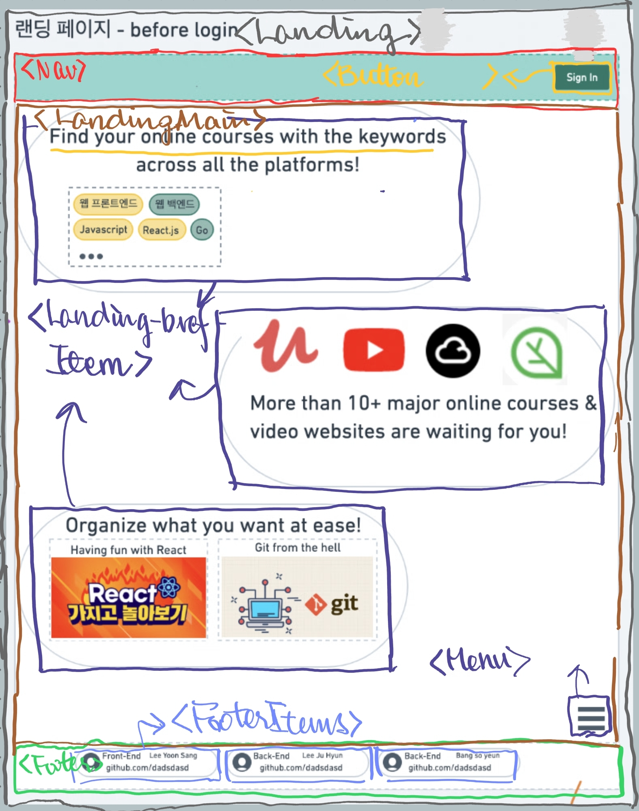

# 01. 랜딩 페이지



## 변환한 pseudo layout code

```HTML
<Landing>
  <!-- 1. Nav -->
  <Nav>
    <!-- Link to /signin -->
    <Button btnType="primary">Sign In</Button>
  </Nav>

  <!-- 2. Landing main -->
  <LandingMain>
    <!-- LandingInfoItemPlacer 는 각 LandingInfoItem을 양 옆으로 위치 해줌 -->
    {<LandingInfoItemPlacer>
      <LandingInfoItem />
    </LandingInfoItemPlacer>} * 5 ~
    <Menu />
  </LandingMain>

  <!-- 3. Footer -->
  <Footer>
    <FooterItems>
      {<FooterItem>}*3
    </FooterItems>
  </Footer>
</Landing>
```

<!-- ## Footer

(Add Footer 확대 이미지)

```javascript
// .../Footer.tsx
const Footer = ({amount = 3}) =>
  (new Array<number>(amount)).map((_, i: number) =>
    <FooterItem
      key=`footer${i}`
      portrait="../img/person1.jpg"
      role="front-end"
      name="kim"
      repoLink="https://github.com/sdsad.da.git"
    />);

// .../FooterItem.tsx
const FooterItem = ({
  portrait: string,
  role: string,
  name: string,
  repoLink: string
}) => (
  <div className={...}>
    
    <h1>{role}</h1>
    <p>{name}</p>
    <p>{repoLink}</p>
  </div className={...}>
);
``` -->
