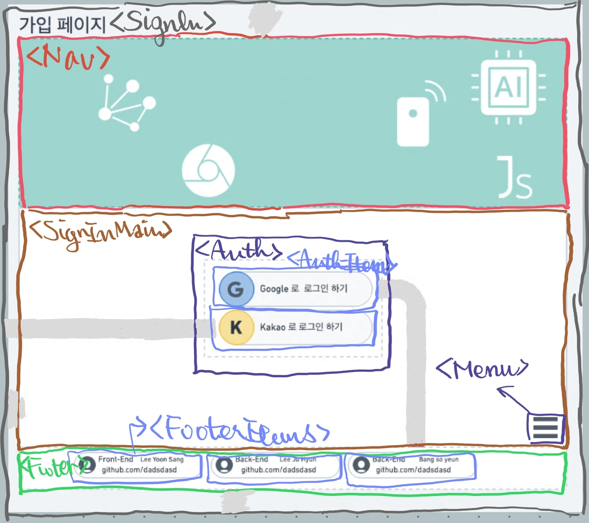

# 02. 가입 페이지



## 변환한 pseudo layout code

```HTML
<SignIn>
  <!-- 1. Nav -->
  <Nav />

  <!-- 2. Main -->
  <SignInMain>
    <AuthItems>
      <!-- link to /signin-google -->
      <Auth authType="google" linkTo="/google" /> 
      <!-- link to /signin-kakao -->
      <Auth authType="kakao" linkTo="/kakao" />
    </AuthItems>
    <Menu />
  </SignInMain>

  <!-- 3. Footer -->
  <Footer>
    <FooterItems>
      {<FooterItem>}*3
    </FooterItems>
  </Footer>
</SignIn>
```
