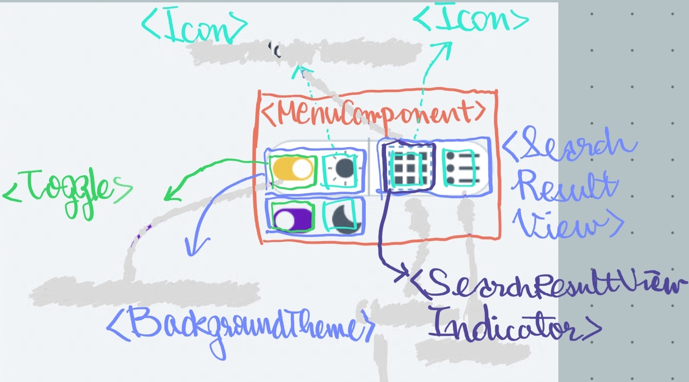

## Menu 컴포넌트



```HTML
<Landing>
  <!-- 1. Nav -->
  <Nav />

  <!-- 2. Main -->
  <SigninMain>
    <AuthItems>
      <!-- link to /signin-google -->
      <Auth authType="google" linkTo="/google" />
      <!-- link to /signin-kakao -->
      <Auth authType="kakao" linkTo="/kakao" />
    </AuthItems>
    <Menu />
  </SigninMain>

  <!-- 3. Footer -->
  <Footer>
    <FooterItems>
      {<FooterItem>}*3
    </FooterItems>
  </Footer>
</Landing>
```
