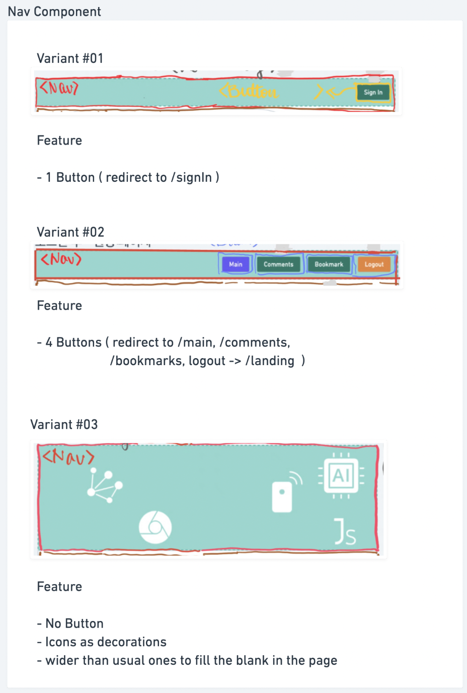
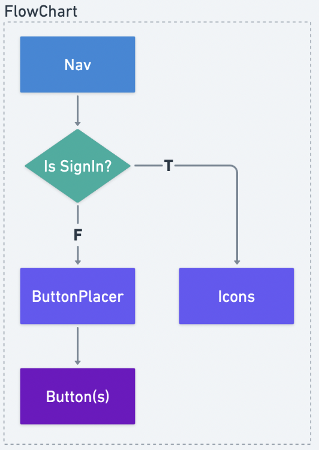

# Nav 컴포넌트

<!-- TODO: rewrite with Callout -->

## Variant #01

- 버튼이 1개 (/signIn 으로 리디렉트)

## Variant #02

- 버튼이 4개 (/main, /comments, /bookmarks, logout to /landing 으로 리디렉트)

## Variant #03

- 버튼이 없음
- 아이콘으로 장식
- /signIn 에서만 사용됨
- 여백 채우기를 위한 다른 Variant 보다 넓은 영역

   

