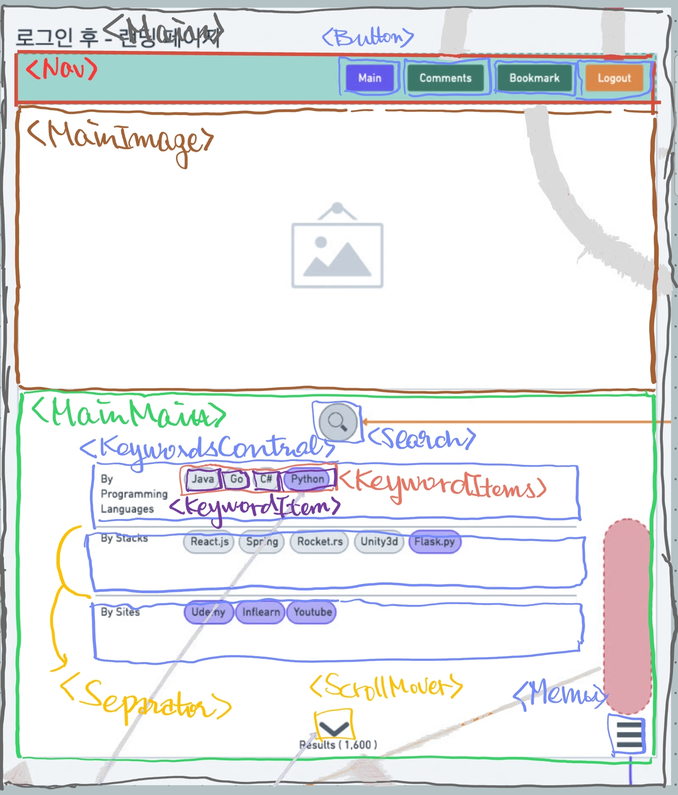

# 03. 메인 페이지



## 변환한 pseudo layout code

```HTML
<Main>
  <!-- 1. Nav -->
  <Nav>
    <!-- Link to /main -->
    <Button btnType="primary">Main</Button>
    <!-- Link to /comments -->
    <Button btnType="alt">Comments</Button>
    <!-- Link to /bookmarks -->
    <Button btnType="alt">Bookmarks</Button>
    <!-- Link to /landing-page -->
    <Button btnType="danger">Main</Button>
  </Nav>

  <!-- 2. Main -->
  <MainMain>
    <!-- MainImage is in changing randomly by interval-->
    <MainImage interval={3}/>

    <!-- Search: click to expand to search by typing -->
    <Search />

    <!-- Select any keywords to decide what to search -->
    <KeywordControls>
      <!-- KeywordControl contain the elements as follows -->
      <KeywordControl keywordType="lang" row={2}>
        <KeywordItems>
          {<KeywordItem />} * keyword amounts
        </KeywordItems>
      </KeywordControl>
      <KeywordControl keywordType="site">
        <KeywordItems>
          {<KeywordItem />} * keyword amounts
        </KeywordItems>
      </KeywordControl>
    </KeywordControls>

    <!-- Menu has grid / list view selector as of now -->
    <Menu />
  </MainMain>

  <!-- 3. Footer -->
  <Footer>
    <FooterItems>
      {<FooterItem>}*3
    </FooterItems>
  </Footer>
</Main>
```
